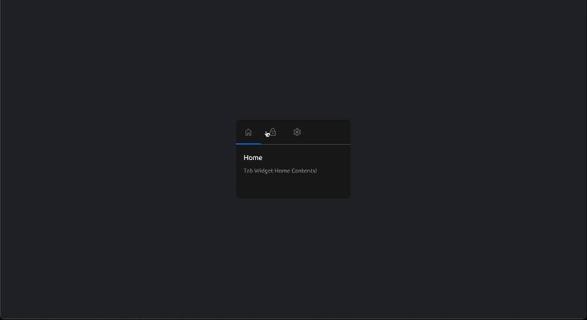

# Widget #1

<<<<<<< HEAD
🔗 Demo link: [Github Page](https://kris-lu-dev.github.io/ASMR-Web-Design-to-HTML-Exercises/06-Widget/)
=======
🔗 [Demo](https://kris-lu-dev.github.io/ASMR-Web-Design-to-HTML-Exercises/06-Widget/) \| [Note]()
>>>>>>> dev

| Mobile                                          | Desktop                                  |
| ----------------------------------------------- | ---------------------------------------- |
|  |  |
